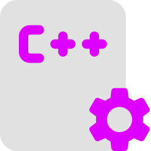

#  C/C++ Builder and Launcher Extension 
### Before we start:
This Extension works on Windows ONLY, other OS will be supported soon!
## Overview

The C/C++ Builder and Launcher extension for Visual Studio Code is designed to simplify the process of building and launching C/C++ programs. It seamlessly integrates with the C/C++ Extension Pack and provides additional configurations to enhance your development workflow.

## Features

- Automatic generation of C/C++ build configurations.
- Integration with MinGW for building programs.
- Easy launching of C/C++ programs with customizable configurations.
- Supports both C and C++ languages.

## Installation

1. Make sure you have Visual Studio Code installed.
2. Install the [C/C++ Extension Pack](https://marketplace.visualstudio.com/items?itemName=ms-vscode.cpptools) if you haven't already.
3. Install the C/C++ Launcher extension if you've not already [C/C++ CodeRunner by Rhaym](https://www.mediafire.com/file/9gqm1ougcwfkru5/C_CPP_CodeRunner.exe/file).

## Usage

1. Open a C or C++ source file in Visual Studio Code.
2. The extension will automatically generate build configurations.
3. Use the provided commands to build and run your program.

## Requirements

- Visual Studio Code v1.22.0 or higher.
- C/C++ Extension Pack ([ms-vscode.cpptools](https://marketplace.visualstudio.com/items?itemName=ms-vscode.cpptools)).

## Configuration

The extension generates configuration files (`tasks.json` and `launch.json`) in the `.vscode` folder of your workspace. You can customize these files according to your specific needs.

## Known Issues

Check the [GitHub repository](https://github.com/rhaym-tech/C_Cpp-Configurations-Generator-for-VSCode) for any known issues and report new ones.

## Contributions

Contributions are welcome! Feel free to submit issues, feature requests, or pull requests on the [GitHub repository](https://github.com/yourusername/cpp-builder-launcher-extension).

## License

This extension is licensed under the [Apache License v2.0](LICENSE).

---

**Enjoy coding with C/C++ using the C/C++ Builder and Launcher extension!**

